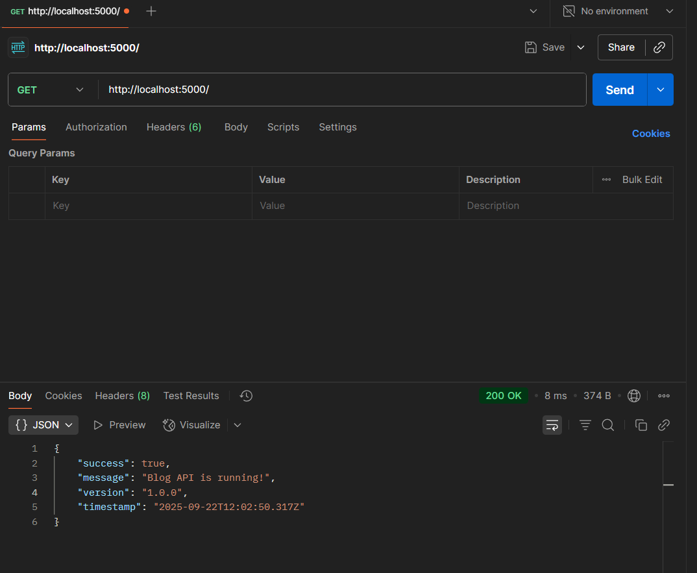
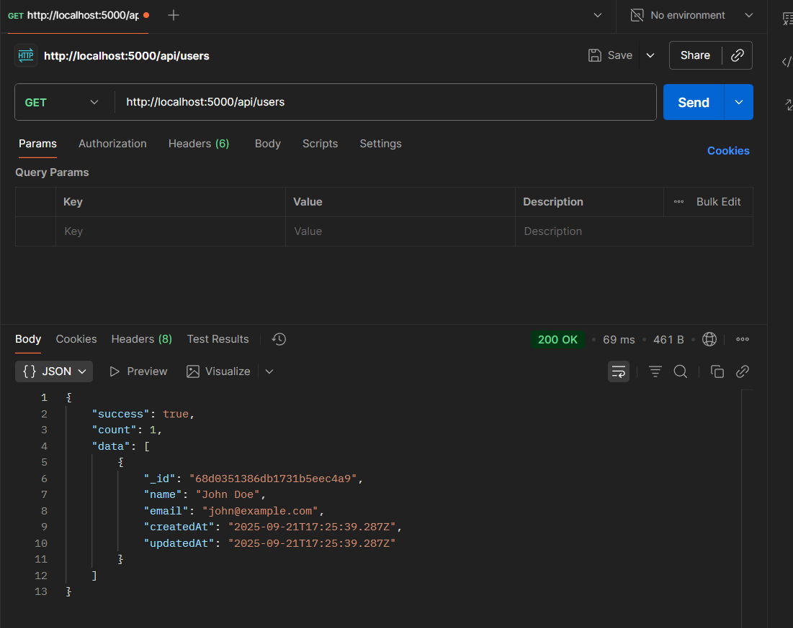

# Blog API

A simple and powerful RESTful API for managing blog posts, users, and comments. Built with Node.js, Express, and MongoDB.

## What does this API do?

This API lets you:
- Register and login users
- Create, read, update, and delete blog posts
- Add comments to posts
- Secure everything with JWT authentication

## Quick Start

### Prerequisites
- Node.js installed
- MongoDB running locally

### Installation
```bash
cd "Assignment 3"
npm install
```

### Environment Setup
Create a `.env` file:
```env
PORT=5000
MONGODB_URI=mongodb://127.0.0.1:27017/blog-api
JWT_SECRET=your_secret_key_here
```

### Run the API
```bash
npm run dev
```

Your API will be running at `http://localhost:5000`

## Features

✅ **User Authentication** - Secure registration and login  
✅ **JWT Security** - Token-based authentication  
✅ **Blog Posts** - Full CRUD operations  
✅ **Comments** - Add comments to posts  
✅ **Categories & Tags** - Organize posts  
✅ **Pagination** - Handle large datasets  
✅ **Error Handling** - Clear error messages  

## Tech Stack

- **Backend**: Node.js, Express.js
- **Database**: MongoDB with Mongoose ODM
- **Authentication**: JWT (JSON Web Tokens)
- **Security**: BCrypt for password hashing
- **Validation**: Mongoose schema validation
- **Environment**: dotenv for configuration management

## Project Structure

## Project Structure

```
Assignment 3/
├── models/          # Database schemas
├── routes/          # API endpoints
├── middleware/      # Authentication logic
├── config/          # Database connection
├── app.js          # Main application
└── README.md       # This file
```

## Installation & Setup

### Prerequisites
- Node.js installed
- MongoDB running locally

### Installation
```bash
cd "Assignment 3"
npm install
```

### Environment Setup
Create a `.env` file:
```env
PORT=5000
MONGODB_URI=mongodb://127.0.0.1:27017/blog-api
JWT_SECRET=your_secret_key_here
```

### Run the API
```bash
npm run dev
```

Your API will be running at `http://localhost:5000`

## API Endpoints

### Welcome
- `GET /` - API information
- `GET /health` - Health check
### Users
- `POST /api/users/register` - Create new user
- `POST /api/users/login` - Login user
- `GET /api/users` - Get all users

### Posts
- `POST /api/posts` - Create post (requires login)
- `GET /api/posts` - Get all posts
- `GET /api/posts/:id` - Get single post
- `PUT /api/posts/:id` - Update post (author only)
- `DELETE /api/posts/:id` - Delete post (author only)

### Comments
- `POST /api/comments` - Add comment (requires login)
- `GET /api/comments/post/:postId` - Get post comments

## How to Test

### 1. Register a User
```bash
POST /api/users/register
Content-Type: application/json

{
  "name": "John Doe",
  "email": "john@example.com",
  "password": "password123"
}
```

### 2. Login
```bash
POST /api/users/login
Content-Type: application/json

{
  "email": "john@example.com",
  "password": "password123"
}
```
*Save the token from the response*

### 3. Create a Post
```bash
POST /api/posts
Authorization: Bearer YOUR_TOKEN_HERE
Content-Type: application/json

{
  "title": "My First Post",
  "content": "This is my first blog post!",
  "categories": ["general"],
  "tags": ["first-post"]
}
```

### 4. Get All Posts
```bash
GET /api/posts
```

## Testing Screenshots

### 1. API Welcome


### 2. Get All Users


### 3. User Registration
## Assignment Requirements

### ✅ Core Features Completed
- User registration and login
- Blog post CRUD operations
- JWT authentication
- MongoDB integration
- Proper error handling

### ✅ Bonus Features Added
- Comments system
- Pagination
- Categories and tags
- Search functionality

## Common Responses

### Success Response
```json
{
  "success": true,
  "message": "Operation successful",
  "data": { ... }
}
```

### Error Response
```json
{
  "success": false,
  "message": "Error description"
}
```

## Contributing

This is an assignment project for the Pixerfect Internship. Feel free to explore the code and learn from it!

---

**Built with ❤️ by Aman Yadav**  
*Pixerfect Internship - Assignment 3*